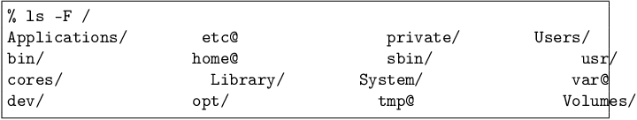
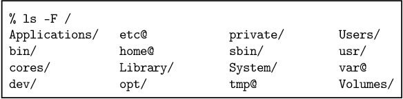

# fwtype

英語版はこちら → **[README.md](README.md)**

`fwtype` は、端末で表示される空白や配置をそのまま保持した状態で、
印刷用や TeX 文書に埋め込むための整形を行うコマンドラインツールです。

組版処理では、ASCII 文字を幅 1、それ以外の文字を幅 2 として扱うことで、
安定した整列を実現しています。

## 動機（Motivation）

Unix ツールの出力をそのまま TeX に埋め込むと、空白幅やインデント、
カラムの整列が変化してしまい、端末と同じレイアウトを再現できません。

`fwtype` は、端末上のレイアウトを **正確に TeX に持ち込む** ために設計されており、
空白や整列を崩すことなく出力することができます。

## 特徴（Features）

- 空白・インデント・整列を正確に保持  
  - ASCII 文字は 1 セル、非 ASCII 文字は 2 セルとして扱う  
- 行番号を任意で付加 (-n)
- picture 環境の横幅（カラム幅）を設定可能 (-w)
- picture 環境の行数を設定可能 (-l)
- フォントサイズを設定可能 (-c)
- 枠（frame）の表示を設定可能 (-f)
- 単体でコンパイル可能な TeX 文書を生成可能 (-S)
- グリッド線の描画を任意で追加 (-g)

## 使用例（Example）

### Example 1

`fwtype` は ASCII と UTF-8 を扱えますが、主に日本語テキストで動作確認しています。

    ASCIIは1桁
    漢字は2桁

`-n` を付けると行番号が追加されます：

### Example 2

`ls` の出力にはタブとスペースが混在しています。これをそのまま TeX で
組版するとレイアウトが乱れてしまい、同様の問題は多くの Web ブラウザでも
発生する可能性があります。

    % ls -F /
    Applications/   etc@        private/    Users/
    bin/        home@       sbin/       usr/
    cores/      Library/    System/     var@
    dev/        opt/        tmp@        Volumes/

`fwtype` は上記の整列・空白を **そのまま** 再現します。

`Verbatim` 環境(fancyvrb.sty)での出力：

`fwtype` の出力：

## インストール（Installation）

ソースコードからビルド：

    git clone https://github.com/k-chinen/fwtype
    cd fwtype
    cargo build –release

## ケーススタディ（Case Study）

最初になんらかのプログラムでデータファイルを作り、
`fwtype` でTeXファイルに変換します。

    % ls -C -F / > /tmp/ls-F-out.txt
    % fwtype /tmp/ls-F-out.txt > ls-F-out.tex

次に `ls-F-out.tex` を読み込むファイル `main.tex` を用意します。

    ...
    \input{ls-F-out}
    ...

最後に、あなたの環境の TeX で文書を組版します。

    % platex main.tex
    % dvipdfmx main.dvi

## 制限事項（Limitations）

- Unicode の結合文字では整列が崩れる場合があります  
- 絵文字などの幅はプラットフォームに依存します  
- ANSI エスケープシーケンスは解釈しません  

## ヘルプ（Help）

    fwtype 0.3.5 (cb87028) [2025-11-23T06:19:00.808308Z]
    Ken-ichi Chinen <k-chinen@metro-cit.ac.jp>
    generate fixed-width printing for LaTeX from plain-text

    USAGE:
        fwtype [FLAGS] [OPTIONS] [FILE]...

    FLAGS:
        -g, --grid            Enable grid. See -G and -Z
        -h, --help            Prints help information
        -n, --numbering       Line numbering
        -p, --pagebreaking    Insert a page break after each picture. See -l
        -u, --spcmarking      Space marking by triangle
        -S, --standalone      Insert preamble and begin/end document in first
        -V, --version         Prints version information

    OPTIONS:
        -A, --above <abovegap>         above gap like ".5em" [default: ]
        -B, --below <belowgap>         below gap like "12pt" [default: ]
        -b, --braise <braise>          baseline raise for ASCII [default: 0]
        -c, --csize <csize>            character size, e.g., "17" or "20x10" in pt [default: 10x5]
        -F, --font               base font [default: \ttfamily\gtfamily]
        -f, --frames <frames>          set of frames [default: 15]
        -G, --ghpitch <ghpitch>        grid pitch in horizontal [default: 5]
        -Z, --gvpitch <gvpitch>        grid pitch in vertical [default: 5]
        -H, --lheight <lheight>        lheight; if not specified csize *1.2 [default: 99999]
        -l, --llimit <llimit>          line limit per picture [default: 9999]
        -N, --lnooffset <lnooffset>    linenumber offset [default: 0]
        -W, --lnowidth <lnowidth>      linenumber width [default: 99999]
        -C, --numcsize <numcsize>      character size of line numbers, e.g., "12x6" in pt [default: 6x3]
        -m, --outmargin <outmargin>    out margin width [default: 5]
        -s, --sepmargin <sepmargin>    sep margin width [default: 2]
        -t, --tabstop <tabstop>        tabstop [default: 8]
        -w, --wlimit <wlimit>          width limit; column per line [default: 64]

    ARGS:
        <FILE>...    Input file(s) [default: -]

    EXAMPLES:
        % fwtype input.txt
        % fwtype -n -u input.txt
        % fwtype -w 80 input.txt
        % fwtype -l 50 -p -n input.txt
        % fwtype -g -G 4 src/*.txt
        % fwtype -S input.txt > output.tex
